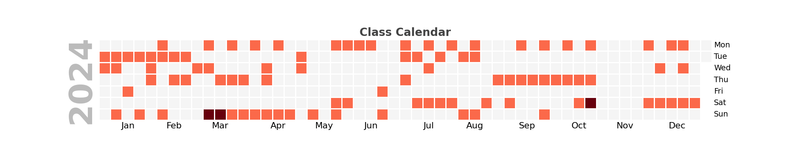

# Mindbody Wrapped

This project allows you to fetch booking data from the Mindbody API, process it, and generate insightful statistics about the classes taken in a specified year. It provides a "Spotify Wrapped"-like summary for a given studio, detailing the total number of classes, most popular class types, preferred instructors, and more.

## Sample output

># A Year with *Your Favourite Studio* ✨
>
>## 🚀 Your 2024 Class Summary
>1. 🎯 You took 72 classes in 2024!  
>2. 🏆 Your favourite class types were:
>   - Reformer Pilates
>   - Zumba Fitness
>   - Intro to Muay Thai
>3. 🌅 Most Active Time: You’re a true Morning champion! 🏅  
>   You took 34 classes in this time!
>4. 📆 Most Popular Day: You absolutely owned Sunday!  
>   With 20 classes, Sundays are clearly your day!
>5. 👑 Your top instructor was John! (12 classes)  
>   It’s no surprise! You loved John's energy and vibe all year. ✨
>6. ⏰ You spent 72 hours moving this year! 

### Class calendar overview

## Usage

### Retrieve Mindbody token
   - Log in to Mindbody: [Mindbody Explore](https://www.mindbodyonline.com/explore/)
   - Open Developer Tools in your browser (Right-click -> Inspect -> Go to the "Network" tab).
   - Look for a network call to `bookings`.
   - Copy the **Authorization Token** from the request headers (Headers -> Request Headers -> Authorization and copy the long string after the word 'Bearer').

### Running locally
1. Install dependencies 
   - `pip install -r requirements.txt`
2. Enter your Mindbody token in `generate_mindbody_wrapped.ipynb`
3. Run `generate_mindbody_wrapped.ipynb` to view Mindbody Wrapped stats